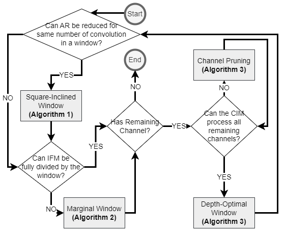

# Project Title

An example for Tetris-SDK mapping algorithm for ISCAS 2024.

## Description

### Title
Tetris-SDK: Efficient Convolution Layer Mapping with Adaptive Windows for Fast In Memory Computing


https://github.com/SybilD/Tetris-SDK-ISCAS/assets/44551139/7088038c-ae13-4802-8742-6e1519874dbf


### Abstract
Shifted-and-Duplicated-Kernel (SDK) mapping has emerged as a promising technique for accelerating convolutional layers in Compute-In-Memory (CIM) architectures. While state-of-the-art SDK variants have achieved decent mapping efficiency, optimizations are still desired to enhance CIM utilization and reduce computing cycles. In this work, we propose Tetris-SDK, a novel tool that exploits adaptive windows to further improve the performance of convolution layer mapping. These windows can accommodate a larger number of input channels, increase array utilization at marginal space, and adjust window shapes to minimize compute latency. 
Our experiments with a $512 \times 512$ CIM array demonstrate that Tetris-SDK remarkably accelerates CNN layers up to $78.4 \times$, $8 \times$, and $1.3 \times$ compared to the baseline mapping algorithms, i.e., img2col, SDK, and VW-SDK, respectively. 
This shows that Tetris-SDK is a promising design automation solution to map Convolutional Neural Networks in CIM hardware. 


### Flowchart


## Getting Started

### Dependencies

* Python 3.x

### Installing

* Any IDE that can run Jupyter Notebook

### Executing program

* Download the file and open it in IDE
* Run cell by cell

```
cc_optimization_with_mo(image, kernel, ic, oc, ar, ac, pw_row, pw_col, pw_ic, pw_oc)
```


## Version History
* 0.1
    * Initial Release
